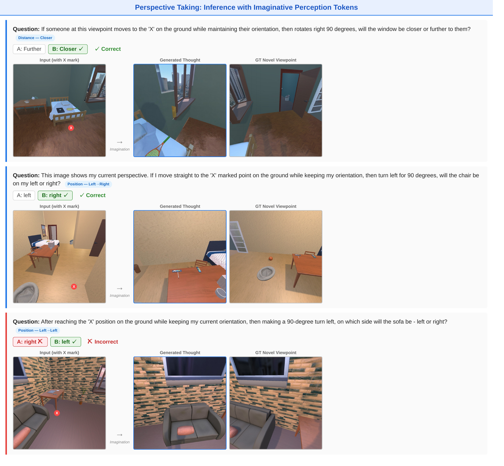
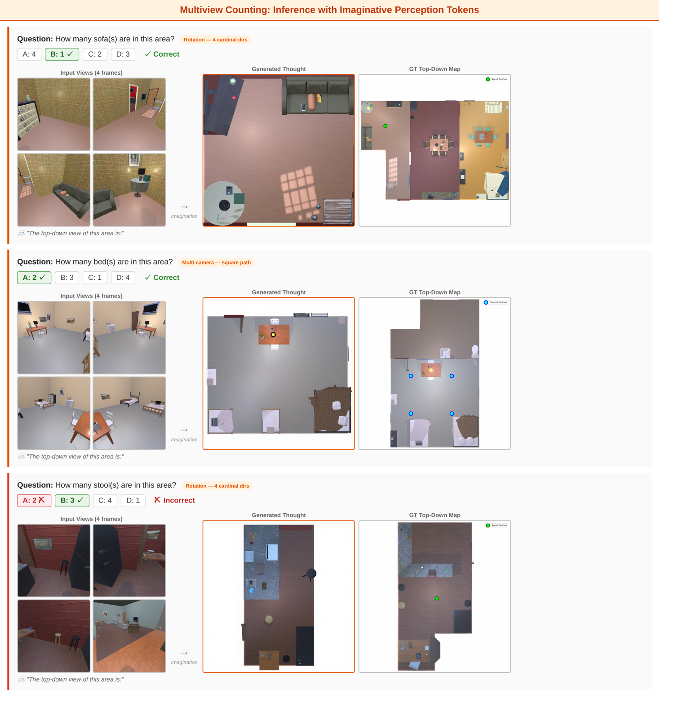
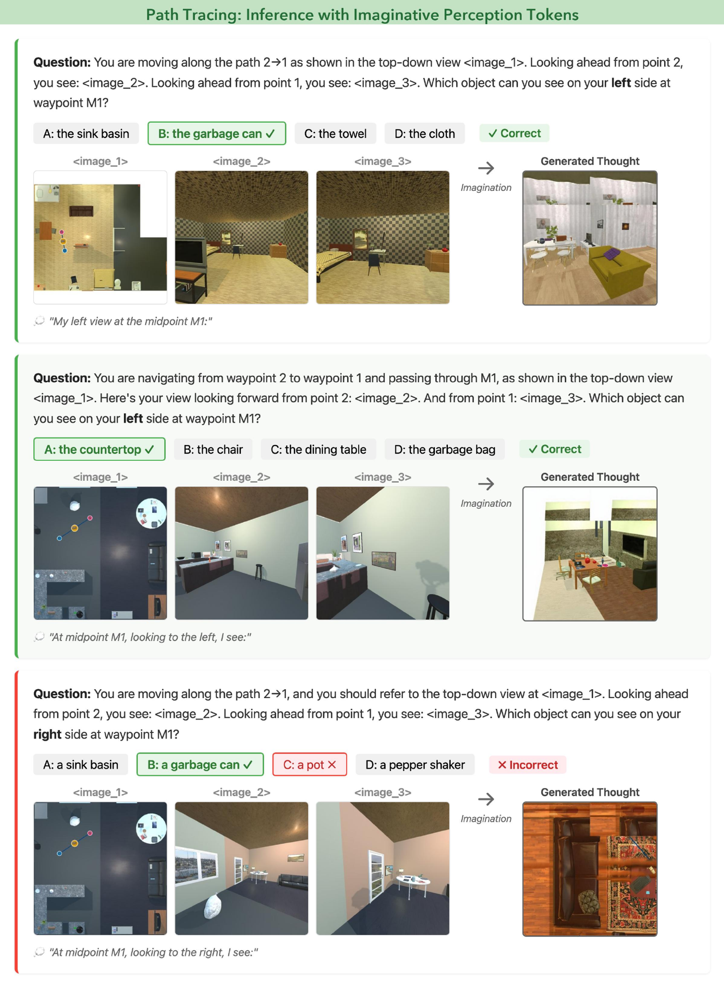

<div align="center">

# Imaginative Perception Tokens (IPT) for Spatial Reasoning

Mahtab Bigverdi<sup>1,2*</sup> · Linjie Li<sup>1*</sup> · Weikai Huang<sup>1,2*</sup> · Yiming Liu<sup>1</sup> · Jaemin Cho<sup>1,2,3</sup> · Jieyu Zhang<sup>1,2</sup> · Tuhin Kundu<sup>3</sup> · Chris Dangjoo Kim<sup>2</sup> · Zelun Luo<sup>4</sup> · Linda G. Shapiro<sup>1</sup> · Ranjay Krishna<sup>1</sup>

<sup>1</sup>University of Washington · <sup>2</sup>Allen Institute for AI · <sup>3</sup>Microsoft · <sup>4</sup>OpenAI

*We train a unified VLM to generate **Imaginative Perception Tokens** — intermediate visual representations of what the model would perceive under an unseen spatial configuration — and show that imagination supervision consistently beats text-based chain-of-thought, even when no image is generated at inference.*

</div>

<p align="center">
  <a href="assets/ipt.mp4">
    
  </a>
</p>

<p align="center">
  
</p>

This repository provides training and evaluation for three spatial imagination tasks:

| Task | What's imagined | Question form |
|------|-----------------|---------------|
| **Perspective Taking (PET)** | Novel-viewpoint scene | *"If you move to the marked position and turn left, will the chair be on your left or right?"* |
| **Path Tracing (PT)** | Sideview along a path | *"If you walk along the marked path, which object will you see?"* |
| **Multiview Counting (MVC)** | Top-down BEV map | *"How many objects are in the scene given these views?"* |

<p align="center">
  <a href="https://arxiv.org/abs/2606.03988">
    
  </a>
  <a href="https://huggingface.co/collections/weikaih/imaginative-perception-token-data-6a15f80e0fcef43bd0c50aba">
    
  </a>
  <a href="https://github.com/weikaih04/Imaginative-Perception-Token-Eval">
    
  </a>
</p>

---

## Datasets at a glance

All datasets live in one [collection](https://huggingface.co/collections/weikaih/imaginative-perception-token-data-6a15f80e0fcef43bd0c50aba). Each task ships three training variants and its own eval sets:

```
Imaginative Perception Token  (weikaih/imaginative-perception-token-data)
│
├── MVC · Multiview Counting
│   ├── train ─ mvc-ipt · mvc-answeronly · mvc-textcot
│   └── eval  ─ multiview_eval (AI2-THOR HV) · messytable · scannet_counting
│
├── PET · Perspective Taking
│   ├── train ─ pet-ipt · pet-answeronly · pet-textcot
│   └── eval  ─ pet-eval-ai2thor · habitat_perspective_eval (HV) · vlmevalkit_tsv (SAT)
│
└── PT · Path Tracing
    ├── train ─ pt-ipt · pt-answeronly · pt-textcot
    └── eval  ─ pt-eval-ai2thor · pt-eval-real
```

**Training variants** — `ipt`: Imaginative Perception Tokens (Visual CoT, generates intermediate images); `textcot`: text-only chain-of-thought; `answeronly`: direct-answer data, serves both the label-only baseline and the answer-only half of Mixed training.

---

## Quick Start (IPT training)

### 1. Environment

```bash
git clone https://github.com/weikaih04/Imaginative-Perception-Token.git
cd Imaginative-Perception-Token
conda create -n ipt python=3.10 -y
conda activate ipt
pip install -r requirements.txt
```

### 2. Download datasets

All 8 paper training datasets (≈30 GB after JPEG optimization) are available in a single [HuggingFace collection](https://huggingface.co/collections/weikaih/imaginative-perception-token-data-6a15f80e0fcef43bd0c50aba):

```bash
python scripts/download_spatial_datasets.py              # all datasets (MVC + PET + PT)
python scripts/download_spatial_datasets.py --task mvc   # MVC only
python scripts/download_spatial_datasets.py --task pet   # PET only
python scripts/download_spatial_datasets.py --task pt    # PT only
```

Parquets land in `data/training/<dataset_name>/`.

### 2.5 Prepare datasets for training

The released HF datasets use a viewer-friendly raw schema. Convert them into the
interleaved training format the dataloader expects (writes `chunk_*.parquet` +
`parquet_info.json` in place):

```bash
python scripts/prepare_datasets.py             # all tasks
python scripts/prepare_datasets.py --task mvc  # a single task (mvc / pet / pt)
```

`data/dataset_info.py` already points the training configs at these folders.

### 3. Train — 4 end-to-end variants per task, matching paper main results

All variants start from `BAGEL-7B-MoT` and train for 25,000 steps. The mixed variants combine IPT and answer-only data 50/50 via dataloader-level mixing.

|  | **Label-only** | **+ Text CoT** | **+ IPT** *(Visual CoT)* | **+ Mixed Training** |
|---|---|---|---|---|
| **MVC** | `train_mvc_no_thought.sh` | `train_mvc_textcot.sh` | `train_mvc_ipt.sh` | `train_mvc_mixed.sh` |
| **PET** | `train_pet_no_thought.sh` | `train_pet_textcot.sh` | `train_pet_ipt.sh` | `train_pet_mixed.sh` |
| **PT** | — | — | `train_pt_ipt.sh` | — |

```bash
bash scripts/train_mvc_ipt.sh    # MVC with imaginative perception tokens
bash scripts/train_pet_mixed.sh  # PET with 50/50 IPT + answer-only mix
```

VAE is automatically enabled for IPT / Mixed variants (which generate intermediate images) and disabled for Label-only / Text CoT (text outputs only) — controlled by the `enable_vae` flag in each YAML config.

### 4. Evaluate

Benchmarks are supported by our eval repo [Imaginative-Perception-Token-Eval](https://github.com/weikaih04/Imaginative-Perception-Token-Eval):

- **In-domain (AI2-THOR, human-verified)**: `MVC_AI2Thor_ImaginativePerceptionToken`, `PET_AI2Thor_ImaginativePerceptionToken`
- **Different environment (human-verified)**: `PET_Habitat_ImaginativePerceptionToken`
- **OOD (similar tasks)**: `PET_SAT_ImaginativePerceptionToken`, `MVC_MessyTable_ImaginativePerceptionToken`, `MVC_ScanNet_ImaginativePerceptionToken`
- **OOD (other spatial)**: `MindCube_ImaginativePerceptionToken`, `AllAngles_ImaginativePerceptionToken`

All linked in the [HuggingFace collection](https://huggingface.co/collections/weikaih/imaginative-perception-token-data-6a15f80e0fcef43bd0c50aba).

---

## Headline Results

| Method | MVC (AI2-THOR) | PET (AI2-THOR) | PET (Habitat) |
|---|:---:|:---:|:---:|
| GPT-5 (zero-shot) | 53.5 | 79.8 | 69.3 |
| Bagel (label-only) | 63.9 | 97.5 | 82.0 |
| + Text CoT | 62.3 | 83.1 | 70.3 |
| **+ IPT** | **67.3** | 96.8 | 87.0 |
| **+ Mixed Training** | 62.3 | **97.8** | **87.7** |

IPT models are evaluated in *answer-only* mode — no image is generated at inference, yet the imagination targets during training strengthen internal spatial representations that transfer across environments.

---

## Qualitative Visualizations

Imaginative Perception Tokens generated during reasoning — the model imagines what it would perceive under the queried spatial configuration before answering.

**Perspective Taking (PET)**
<p align="center"></p>

**Multiview Counting (MVC)**
<p align="center"></p>

**Path Tracing (PT)**
<p align="center"></p>

---

## Citation

```bibtex
@misc{bigverdi2026imaginativeperceptiontokensenhance,
      title={Imaginative Perception Tokens Enhance Spatial Reasoning in Multimodal Language Models},
      author={Mahtab Bigverdi and Linjie Li and Weikai Huang and Yiming Liu and Jaemin Cho and Jieyu Zhang and Tuhin Kundu and Chris Dangjoo Kim and Zelun Luo and Linda Shapiro and Ranjay Krishna},
      year={2026},
      eprint={2606.03988},
      archivePrefix={arXiv},
      primaryClass={cs.AI},
      url={https://arxiv.org/abs/2606.03988},
}
```
